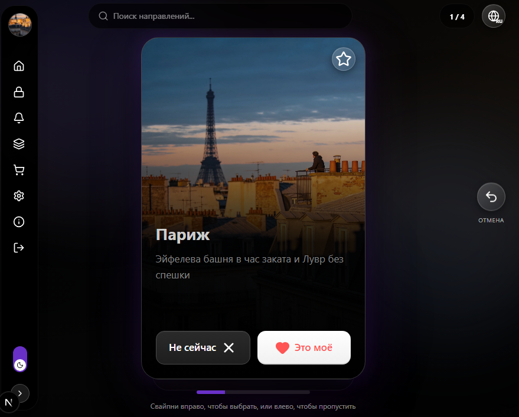
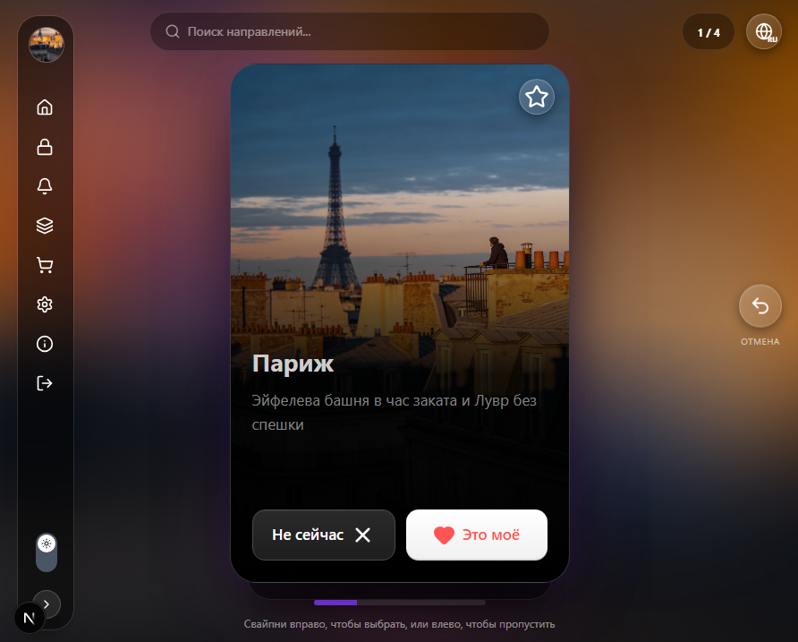
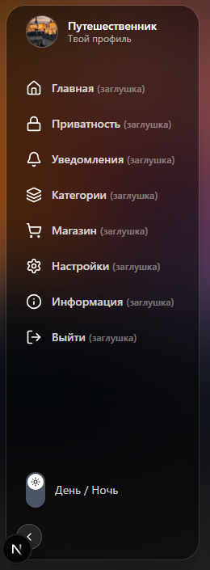

# Travel Swipe App

**Свайп-приложение для выбора направлений для путешествий.**

Пет-проект на Next.js: карточки городов, свайпы влево/вправо, динамический фон, темы день/ночь, мультиязычность. Прототип сделан через AI (v0).

> ⚠️ **Статус: v0.0.2 — активная разработка.**  
> В планах: тесты, избранное с сохранением, экран профиля. Известные задачи — в разделе [TODO](#-todo) и [Issues](https://github.com/Sovinka20/swipeable-card-stack/issues).

---

## ✨ Возможности

- **Свайп-механика** — карточки направлений, drag-and-drop через Framer Motion.
- **Динамический фон** — размытая копия текущей карточки с плавным кроссфейдом при перелистывании.
- **Темы день/ночь** — плавное переключение, фон реагирует на тему (яркость, насыщенность).
- **Анимации реакций** — красное сердце с искрами при «Это моё», разбитое чёрное сердце при «Не сейчас», звезда избранного.
- **Мультиязычность (RU/EN)** — переключение языка в шапке, данные карточек подгружаются из соответствующего JSON.
- **Избранное** — звёздочка на карточке, список последних трёх избранных справа.
- **Отмена** — кнопка возврата к предыдущей карточке.
- **Прогресс-бар** — индикатор текущей позиции в списке.
- **Мобильная адаптивность** — интерфейс подстраивается под экран.

---

## 🖼 Скриншоты

### Главный экран (тёмная тема)
  
*Карточка направления, динамический фон, тёмная тема*

### Светлая тема
  
*То же приложение с переключённой темой*

### Меню и профиль
  
*Боковое меню, профиль, переключатель темы*

---

## 🏗 Архитектура

Приложение построено на **Next.js 16 (App Router)** с использованием **React 19** и **TypeScript**.

**Основные слои:**

- **`app/`** — страницы и layout.
- **`components/`** — UI: `SwipeCard`, `Sidebar`, `TopBar`, `ThemeSwitch`, `MenuItem`.
- **`store/`** — глобальное состояние на Zustand (язык, тема, избранное, текущий индекс).
- **`locales/data/`** — данные карточек на разных языках (`ru.json`, `en.json`).
- **`public/scenario_output/`** — изображения направлений.

**Ключевые технические решения:**

1. **Динамический фон** — размытая копия текущей карточки с `AnimatePresence` и `key={card.id}`. Плавный кроссфейд при перелистывании.
2. **Гибридная структура карточки** — картинка на всю высоту (absolute), поверх неё градиент и текст с фиксированной позицией, чтобы layout не прыгал при разной длине заголовка.
3. **Zustand + persist** — состояние языка, темы и избранного сохраняется в localStorage между сессиями.
4. **Data-driven i18n** — карточки подтягиваются из JSON по ключу языка. Интерфейсные тексты пока хардкод, вынесены в план.

---

## 🛠 Стек

**Frontend:**
- Next.js 16 (App Router)
- React 19
- TypeScript
- Tailwind CSS 4

**Библиотеки:**
- `framer-motion` — анимации и drag
- `zustand` — глобальное состояние
- `lucide-react` — иконки

**Инфраструктура:**
- Vite
- Git

**Прототип:**
- Сделан через AI (v0)

---

## 🚀 Установка

### Локальный запуск

1. Клонируйте репозиторий:

   ```bash
   git clone https://github.com/Sovinka20/swipeable-card-stack.git
   cd swipeable-card-stack
   ```

2. Установите зависимости:

   ```bash
   pnpm install
   ```

3. Запустите dev-сервер:

   ```bash
   pnpm dev
   ```

4. Откройте `http://localhost:3000`.

### Сборка

```bash
pnpm build
pnpm start
```

---

## 📋 Использование

1. **Свайп вправо** — «Это моё», карточка улетает с анимацией.
2. **Свайп влево** — «Не сейчас», карточка пропускается.
3. **Звезда в углу** — добавить в избранное (не листает карточку).
4. **Глобус в шапке** — переключить язык (RU/EN).
5. **Луна/солнце в меню** — переключить тему.
6. **Кнопка «Отмена»** — вернуться к предыдущей карточке.

---

## 🛠 Требования

- **Node.js** 20+
- **pnpm** (или npm/yarn)

---

## 🚧 Известные ограничения

- Интерфейсные тексты (меню, кнопки) пока на русском, не вынесены в i18n.
- Нет автотестов.
- Данные для демо ограничены (~20 карточек вместо полного набора).
- Мобильная версия адаптирована, но не протестирована на всех устройствах.

---

## 🗺 TODO

### Ближайшее
- [ ] Вынести UI-тексты в `locales/ui/ru.json` и `en.json`.
- [ ] Подключить хук `useTranslation` для меню, кнопок, подписей.
- [ ] Сохранять избранное в localStorage (сейчас сбрасывается при перезагрузке).
- [ ] Добавить экран профиля с избранными направлениями.
- [ ] Тесты: Vitest + React Testing Library для `SwipeCard`, `useAppStore`.

### Среднесрочное
- [ ] Экран поиска направлений (сейчас заглушка в `TopBar`).
- [ ] Экран настроек.
- [ ] Загрузка данных через API вместо статических JSON.
- [ ] Деплой на GitHub Pages (workflow + `basePath`).

### Долгосрочное
- [ ] Синхронизация избранного между устройствами.
- [ ] Фильтры по типу карточки (hero, food, activity и т.д.).
- [ ] Экспорт избранных направлений в PDF/Markdown.

---

## 👨‍💻 Автор

**Sovinka20 (Ekaterina German)**  
GitHub: [@Sovinka20](https://github.com/Sovinka20)  
Email: 2015gev@gmail.com  
Telegram: [@Sovires](https://t.me/Sovires)

---

## 📄 Лицензия

MIT. См. [LICENSE](LICENSE).

---

## 🙏 Благодарности

- Иконки — [Lucide](https://lucide.dev).
- Анимации — [Framer Motion](https://www.framer.com/motion/).
- Прототип — [v0](https://v0.dev).
- Вдохновение — Tinder-style механика.

---

## 🐛 Обратная связь

Нашли баг или есть идея? Создавайте [issue](https://github.com/Sovinka20/swipeable-card-stack/issues).

---

